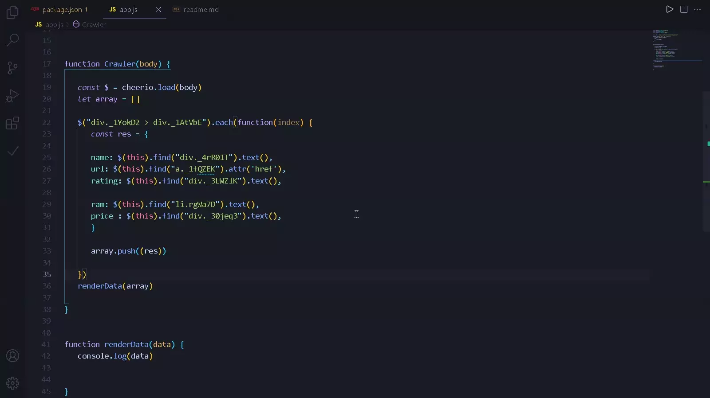

## Get Data From [FlipKart](https://www.flipkart.com/search?q=mobiles) With NodeJS

#### web crawl flipkart.com and extract data from the website and save data in another file to use.



## Clone : 

clone the repository to contribute

```bash
git clone <repo link>
```

## Dependencies : 

```bash
npm i request cheerio fs
```

## Contributing
Pull requests are welcome. For major changes, please open an issue first to discuss what you would like to change.

Please make sure to update tests as appropriate.

## License
[MIT](https://choosealicense.com/licenses/mit/)
